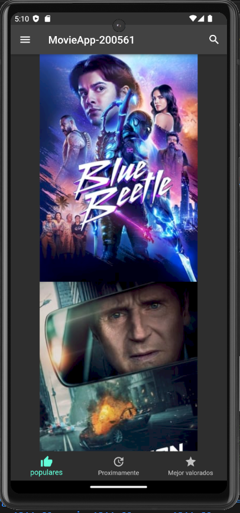
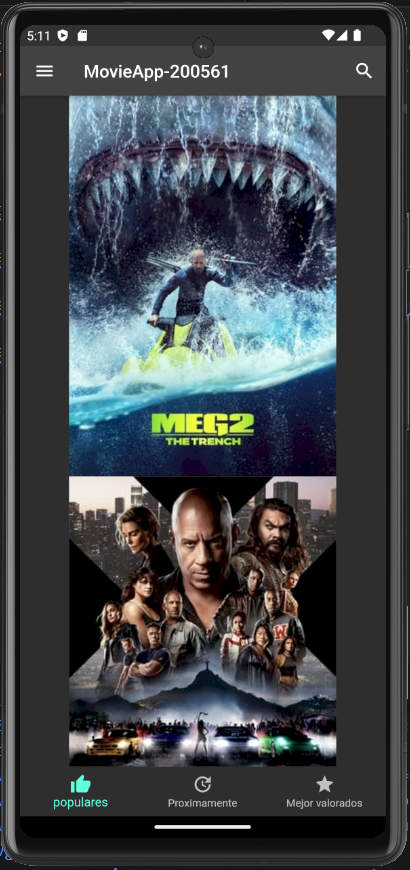
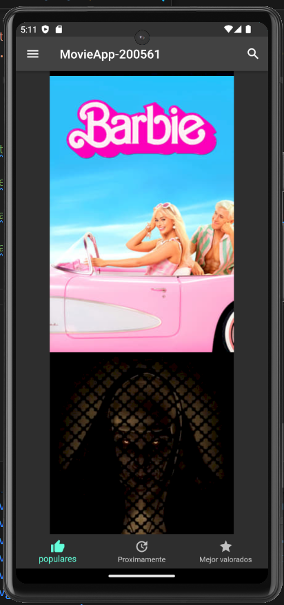

# DMI_Practica7_200561

  
# Universidad Tecnológica de Xicotepec de Juárez

## Ingeniería en Desarrollo y Gestión de Software
## Elisama Arturo Calva Moreno
## 10A
### Desarrollo Móvil Integral

## Capturas de Pantalla

  
  
  

&nbsp;
&nbsp;

|  Característica |  Información |
| :------------: | :------------: |
| Nombre  |  Practica 8 Aplicación en Flutter y StatelesWidgets |
| Descripción  | Esta aplicación fue creada con Flutter con la finalidad de poder mostrar un ejemplo sencillo de la aplicación que brinda acceso directo a las peliculas y series del momento. Esta aplicación permite explorar un catálogo de expansión y películas, series. Con "MovieAPP," puedes sumergirte en experiencias completas, accediendo a información detallada sobre cada título y sus fechas de lanzamiento. Además, disfruta de una integración fluida con tus servicios de transmisión preferidos, permitiéndote ver películas y episodios directamente desde la aplicación. Ya seas un apasionado del cine o un fanático de las series, "MovieAPP" te brinda una experiencia personalizada al permitirte crear y administrar listas de reproducción adaptadas a tus preferencias. Su interfaz de usuario elegante y fácil navegación garantiza una experiencia intuitiva y gratificante. En resumen, "MovieAPP" se convierte en tu compañero esencial para explorar, descubrir y disfrutar del fascinante mundo del entretenimiento audiovisual. |
|  Fecha de Carga | 28/09/23  |

&nbsp;
&nbsp;

&nbsp;
&nbsp;

 
 
 
 

&nbsp;
&nbsp;
